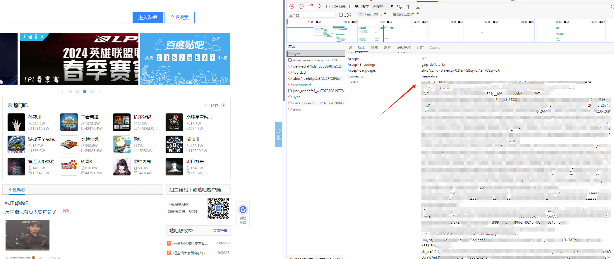

# 百度贴吧自动签到

## 项目介绍

- 百度贴吧自动签到；
- Rust新手，练手项目，仅保证功能跑。 

## 使用说明

### 自行编译

1. 确保自身有Rust环境。
2. 克隆本项目，进入项目目录,执行`cargo build --release`。

    ```shell
        git clone https://github.com/YenHarvey/BaiduTiebaCheckIn.git
        cd baidu-tieba-auto-sign
        cargo build --release
    ```
3. 编译完成后，`target/release`目录下会生成可执行文件`baidu-tieba-auto-sign`。
4. 在同级目录创建一个cookie.txt文件，内容为百度贴吧的cookie。
5. 运行可执行文件。

### 直接下载

1. 在`release`下载平台的可执行文件。
2. 在同级目录创建一个cookie.txt文件，内容为百度贴吧的cookie。
3. 运行可执行文件。

### cookie.txt文件

进入百度贴吧，按`F12`打开开发者工具，刷新网页，在sync的请求头中找到`Cookie`，复制其内容到`cookie.txt`文件中。

